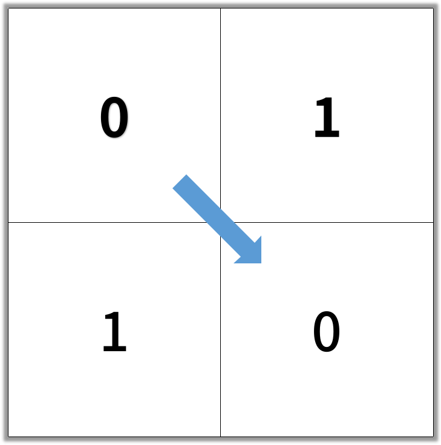

## Description

In an N by N square grid, each cell is either empty (0) or blocked (1).

A *clear path from top-left to bottom-right* has length `k` if and only if it is composed of cells `C_1, C_2, ..., C_k` such that:

- Adjacent cells `C_i` and `C_{i+1}` are connected 8-directionally (ie., they are different and share an edge or corner)
- `C_1` is at location `(0, 0)` (ie. has value `grid[0][0]`)
- `C_k` is at location `(N-1, N-1)` (ie. has value `grid[N-1][N-1]`)
- If `C_i` is located at `(r, c)`, then `grid[r][c]` is empty (ie. `grid[r][c] == 0`).

Return the length of the shortest such clear path from top-left to bottom-right. If such a path does not exist, return -1.

 

**Example 1:**

```
Input: [[0,1],[1,0]]
Output: 2
```



**Example 2:**

```
Input: [[0,0,0],[1,1,0],[1,1,0]]
Output: 4
```

 


**Note:**

1. `1 <= grid.length == grid[0].length <= 100`
2. `grid[r][c]` is `0` or `1`

## Thinking

BFS

DFS is OK but its time complexity is higher than BFS.

Remember to set visited before or right after offering the node in the queue, otherwise you will get TLE. Details in the second link in [Further](#Further).

## Solutions

~~~java
class Solution {
    public int shortestPathBinaryMatrix(int[][] grid) {
        int[][] dir = new int[][]{{-1, -1}, {0, -1}, {1, -1}, {1, 0}, {1, 1}, {0, 1}, {-1, 1}, {-1, 0}};
        int m = grid.length, res = 0;
        if(grid[0][0] == 1 || grid[m - 1][m - 1] == 1) return -1;
        Queue<int[]> queue = new LinkedList<int[]>();
        queue.offer(new int[]{0, 0});
        grid[0][0] = 1;
        while(!queue.isEmpty()) {
            ++res;
            int len = queue.size();
            for(int i = 0; i < len; i++) {
                int[] pop = queue.poll();
                if(pop[0] == m - 1 && pop[1] == m - 1) return res;
                for(int j = 0; j < 8; j++) {
                    int a = dir[j][0] + pop[0], b = dir[j][1] + pop[1];
                    if(0 <= a && a < m && 0 <= b && b < m && grid[a][b] != 1) {
                        queue.offer(new int[]{a, b});
                        grid[a][b] = 1;
                    }
                }
                grid[pop[0]][pop[1]] = 1;
            }
        }
        return -1;
    }
}
~~~


## Further

https://leetcode.com/problems/shortest-path-in-binary-matrix/discuss/312706/JAVA-BFS

https://leetcode.com/problems/shortest-path-in-binary-matrix/discuss/312846/Why-does-this-simple-BFS-give-TLE