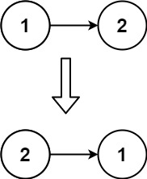

## Description

Given the `head` of a singly linked list, reverse the list, and return *the reversed list*.

 

**Example 1:**


```
Input: head = [1,2,3,4,5]
Output: [5,4,3,2,1]
```

**Example 2:**



```
Input: head = [1,2]
Output: [2,1]
```

**Example 3:**

```
Input: head = []
Output: []
```

 

**Constraints:**

- The number of nodes in the list is the range `[0, 5000]`.
- `-5000 <= Node.val <= 5000`

 

**Follow up:** A linked list can be reversed either iteratively or recursively. Could you implement both?

## Thinking

1. Iterative
2. Recursive

## Solutions

~~~java
/**
 * Definition for singly-linked list.
 * public class ListNode {
 *     int val;
 *     ListNode next;
 *     ListNode() {}
 *     ListNode(int val) { this.val = val; }
 *     ListNode(int val, ListNode next) { this.val = val; this.next = next; }
 * }
 */
//Iterative
class Solution {
    public ListNode reverseList(ListNode head) {
        ListNode prev = null, node = head;
        while(node != null) {
            ListNode then = node.next;
            node.next = prev;
            prev = node;
            node = then;
        }
        return prev;
    }
}

//Recursive
class Solution {
    public ListNode reverseList(ListNode head) {
        if(head == null) return null;
        if(head.next == null) return head; 
        ListNode reversed = reverseList(head.next);
        head.next.next = head;
        head.next = null;
        return reversed;
    }
}
~~~


## Further

https://github.com/labuladong/fucking-algorithm/blob/master/%E6%95%B0%E6%8D%AE%E7%BB%93%E6%9E%84%E7%B3%BB%E5%88%97/%E9%80%92%E5%BD%92%E5%8F%8D%E8%BD%AC%E9%93%BE%E8%A1%A8%E7%9A%84%E4%B8%80%E9%83%A8%E5%88%86.md