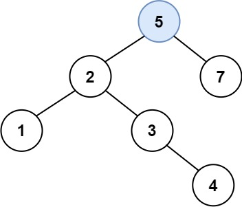

## Description

You are given the `root` node of a binary search tree (BST) and a `value` to insert into the tree. Return *the root node of the BST after the insertion*. It is **guaranteed** that the new value does not exist in the original BST.

**Notice** that there may exist multiple valid ways for the insertion, as long as the tree remains a BST after insertion. You can return **any of them**.

 

**Example 1:**


```
Input: root = [4,2,7,1,3], val = 5
Output: [4,2,7,1,3,5]
Explanation: Another accepted tree is:
```



**Example 2:**

```
Input: root = [40,20,60,10,30,50,70], val = 25
Output: [40,20,60,10,30,50,70,null,null,25]
```

**Example 3:**

```
Input: root = [4,2,7,1,3,null,null,null,null,null,null], val = 5
Output: [4,2,7,1,3,5]
```

 

**Constraints:**

- The number of nodes in the tree will be in the range `[0, 104]`.
- `-108 <= Node.val <= 108`
- All the values `Node.val` are **unique**.
- `-108 <= val <= 108`
- It's **guaranteed** that `val` does not exist in the original BST.

## Thinking

Recursive BST search, when root equals to null, root is the place insert value should be. 

## Solutions

~~~java
/**
 * Definition for a binary tree node.
 * public class TreeNode {
 *     int val;
 *     TreeNode left;
 *     TreeNode right;
 *     TreeNode() {}
 *     TreeNode(int val) { this.val = val; }
 *     TreeNode(int val, TreeNode left, TreeNode right) {
 *         this.val = val;
 *         this.left = left;
 *         this.right = right;
 *     }
 * }
 */
class Solution {
    public TreeNode insertIntoBST(TreeNode root, int val) {
        if(root == null) {
            root = new TreeNode(val);
        } else if(root.val < val) {
            root.right = insertIntoBST(root.right, val);
        } else if(root.val > val) {
            root.left = insertIntoBST(root.left, val);
        }
        return root;
    }
}
~~~


## Further

https://github.com/labuladong/fucking-algorithm/blob/master/%E6%95%B0%E6%8D%AE%E7%BB%93%E6%9E%84%E7%B3%BB%E5%88%97/%E4%BA%8C%E5%8F%89%E6%90%9C%E7%B4%A2%E6%A0%91%E6%93%8D%E4%BD%9C%E9%9B%86%E9%94%A6.md